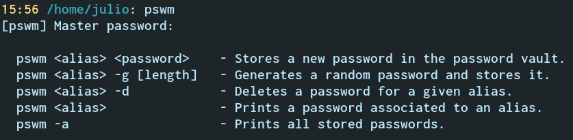

# pswm
A simple command line password manager written in python.



## Dependencies

pswm uses cryptocode & bcrypt which can be installed through pip:

```
pip3 install cryptocode
pip3 install py-bcrypt
```

It has been tested with Python 3.8.10. 
Results may vary if other versions are used.


## Installation

The following commands will download the latest version of pswm from this repository 
and install it in your `/usr/bin/` directory:
```
git clone https://github.com/Julynx/pswm
cd pswm-master
chmod +x pswm
sudo cp pswm /usr/bin/
```
The program can now be ran from a terminal with the command `pswm`.


## Usage

When running pswm for the first time, you will be prompted to define a master password which will be used to encrypt your other passwords. 
The master password is salted and hashed and the hash is stored in a file named `.$pswm$` inside your home folder. 

If you forget your master password, pswm will give you the option to reset it after three failed attempts. This would delete all your saved passwords, since they would be encrypted with your old master password and impossible to decrypt without it. You should store your master password somewhere safe or choose something you will always remember.

After choosing a master password, a password vault will be created as a file named `.pswm` inside your home folder, to store your encrypted passwords. You can use any of the following commands to access your password vault:
```
  pswm <alias> <password>    - Stores a new password in the password vault.
  pswm <alias> -g [length]   - Generates a random password and stores it.
  pswm <alias> -d            - Deletes a password for a given alias.
  pswm <alias>               - Prints a password associated to an alias.
  pswm -a                    - Prints all stored passwords.
```

## License

This software comes without any warranty as distributed under the GNU GPL 2.0 license.
You should receive a copy of the license with your download of pswm. 
The GNU GPL 2.0 license is available under the following url
https://www.gnu.org/licenses/old-licenses/gpl-2.0-standalone.html
